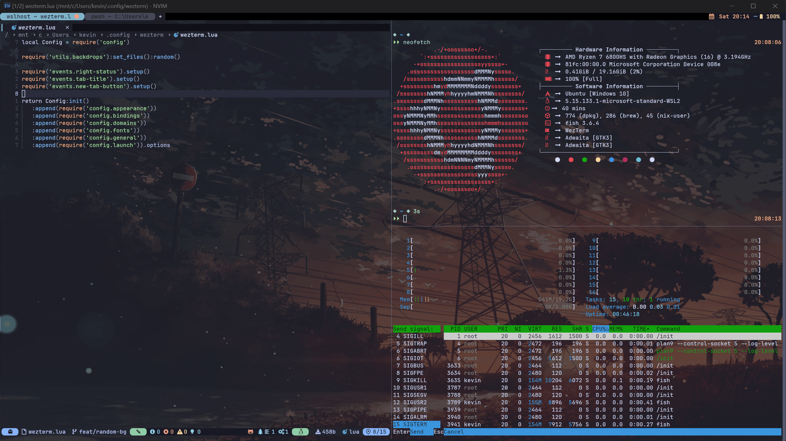

# WezTerm Configuration

Personal WezTerm configuration with automatic dark/light theme switching and modular structure.



## Features

- **Automatic theme switching**: Switches between dark (vaporwave-dark) and light (xcode-light) themes based on system appearance
- **Modular configuration**: Organized into separate modules for easy maintenance
  - `config/`: Core settings (appearance, bindings, domains, fonts, general, launch)
  - `colors/`: Custom color schemes
  - `events/`: Status bar and tab title handlers
  - `utils/`: Utility functions and helpers
- **Custom status bars**: Left and right status bars with custom styling
- **Background image support**: Optional backdrop images (currently disabled)

## Structure

```
wezterm/
├── wezterm.lua           # Main entry point
├── config/
│   ├── init.lua          # Config initialization
│   ├── appearance.lua    # Visual settings
│   ├── bindings.lua      # Key bindings
│   ├── domains.lua       # SSH/WSL domains
│   ├── fonts.lua         # Font configuration
│   ├── general.lua       # General settings
│   └── launch.lua        # Shell launch settings
├── colors/
│   ├── vaporwave-dark.lua
│   ├── xcode-light.lua
│   └── custom.lua
├── events/
│   ├── left-status.lua
│   ├── right-status.lua
│   ├── tab-title.lua
│   └── new-tab-button.lua
└── utils/
    ├── backdrops.lua
    ├── cells.lua
    ├── gpu-adapter.lua
    ├── math.lua
    ├── opts-validator.lua
    └── platform.lua
```

## Installation

```sh
# Clone to WezTerm config directory
git clone https://github.com/ealecho/editor-configs.git ~/editor-configs
ln -s ~/editor-configs/wezterm ~/.config/wezterm
```

Or manually copy the wezterm directory:

```sh
cp -r ~/editor-configs/wezterm ~/.config/wezterm
```

## Customization

- Edit `config/domains.lua` for custom SSH/WSL domains
- Edit `config/launch.lua` for preferred shells and paths
- Modify theme colors in `colors/` directory
- Uncomment backdrop lines in `wezterm.lua` to enable background images

## Credits

Based on configuration from [KevinSilvester/wezterm-config](https://github.com/KevinSilvester/wezterm-config)
